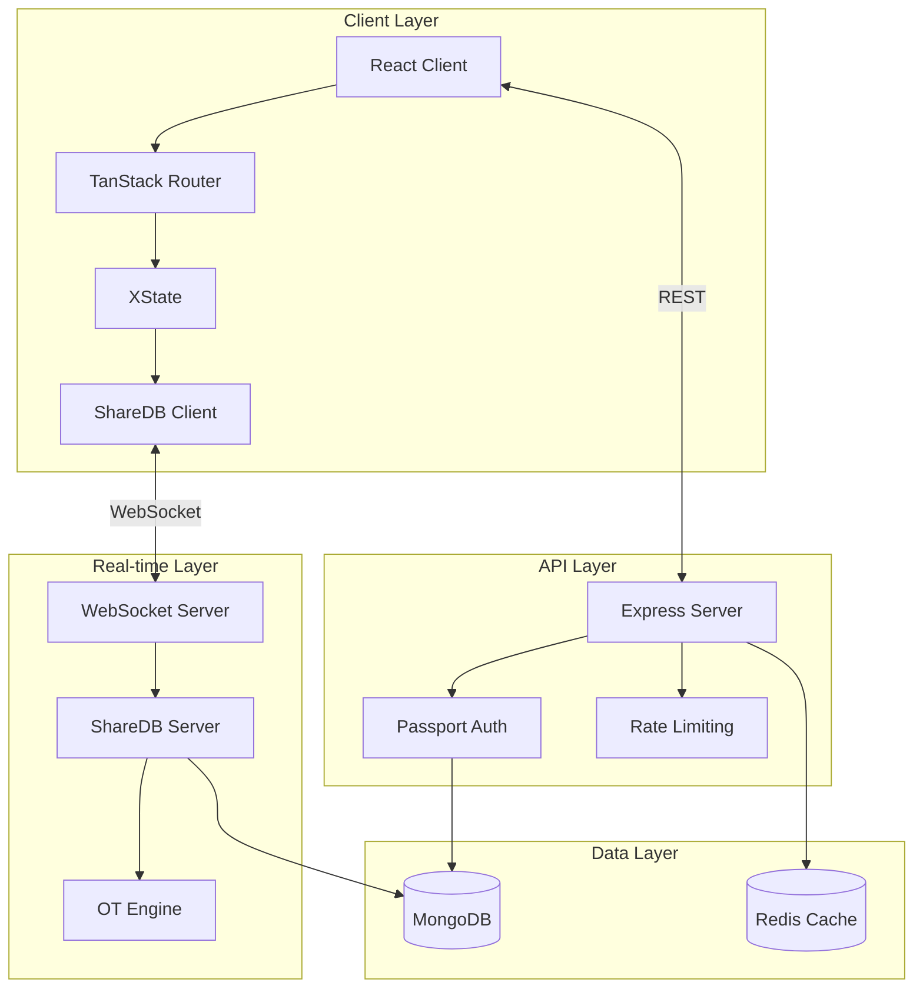
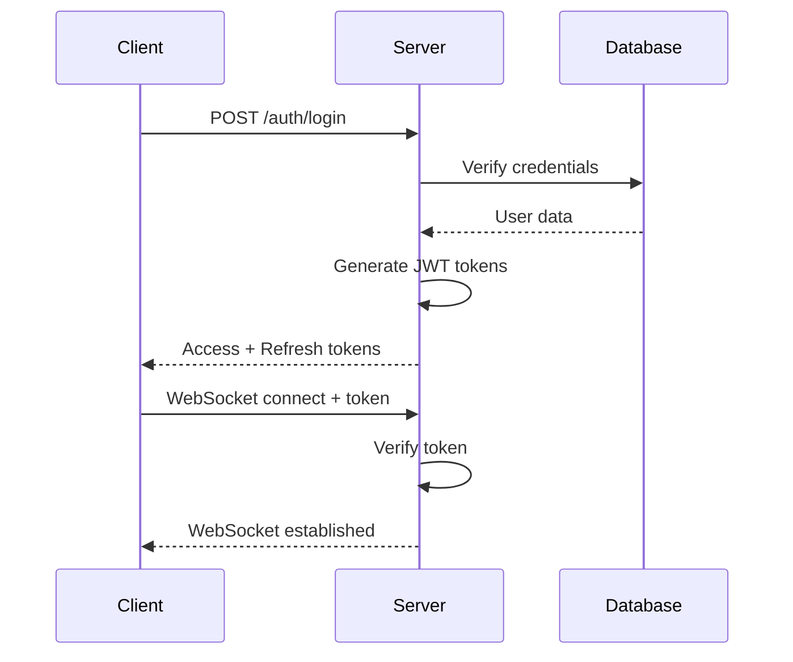

# Architecture

This section covers the system architecture, design patterns, and technical decisions behind the Collaborative Document Editing Demo.

## System Overview

The application follows a modern microservices-inspired architecture with clear separation of concerns:

## Key Design Decisions

### 1. TypeScript Monorepo

We chose a monorepo structure using Turborepo for several reasons:
- **Shared code**: Common types and utilities across frontend and backend
- **Atomic changes**: Related changes across packages in single commits
- **Consistent tooling**: Unified linting, formatting, and testing

### 2. ShareDB for Real-time Collaboration

ShareDB provides operational transformation (OT) out of the box:
- **Automatic conflict resolution**: No manual merge conflicts
- **Proven technology**: Battle-tested in production environments
- **MongoDB integration**: Native support for our chosen database

### 3. JWT Authentication

Token-based authentication provides:
- **Stateless sessions**: Better scalability
- **Secure WebSocket auth**: Tokens passed during handshake
- **Role-based access**: Embedded user roles in tokens

## Component Architecture

### Frontend Architecture

The React client follows a layered architecture:

1. **Presentation Layer**: React components with Tailwind CSS
2. **State Management**: XState for complex UI states
3. **Routing**: TanStack Router for type-safe navigation
4. **Data Sync**: ShareDB client for real-time updates

### Backend Architecture

The Express server implements:

1. **API Routes**: RESTful endpoints for CRUD operations
2. **Middleware Stack**: Authentication, rate limiting, logging
3. **ShareDB Integration**: WebSocket upgrade handling
4. **Database Layer**: MongoDB with proper indexing

## Security Architecture

### Authentication Flow

### Permission Model

Document access follows a hierarchical model:
- **Owner**: Full control (read, write, delete, share)
- **Editor**: Read and write access
- **Viewer**: Read-only access

## Performance Considerations

### Optimization Strategies

1. **Connection Pooling**: Reuse MongoDB connections
2. **Caching**: Redis for session and permission caching
3. **Rate Limiting**: Prevent abuse and ensure fair usage
4. **Compression**: gzip for API responses

### Scalability Design

The architecture supports horizontal scaling:
- **Stateless API servers**: Can run multiple instances
- **ShareDB clustering**: Redis pub/sub for multi-server setup
- **MongoDB sharding**: For large-scale deployments

## Next Steps

- Explore the [Development Guide](/development) for implementation details
- Review the [API Reference](/api) for endpoint documentation
- Check the [Deployment Guide](/deployment) for production setup