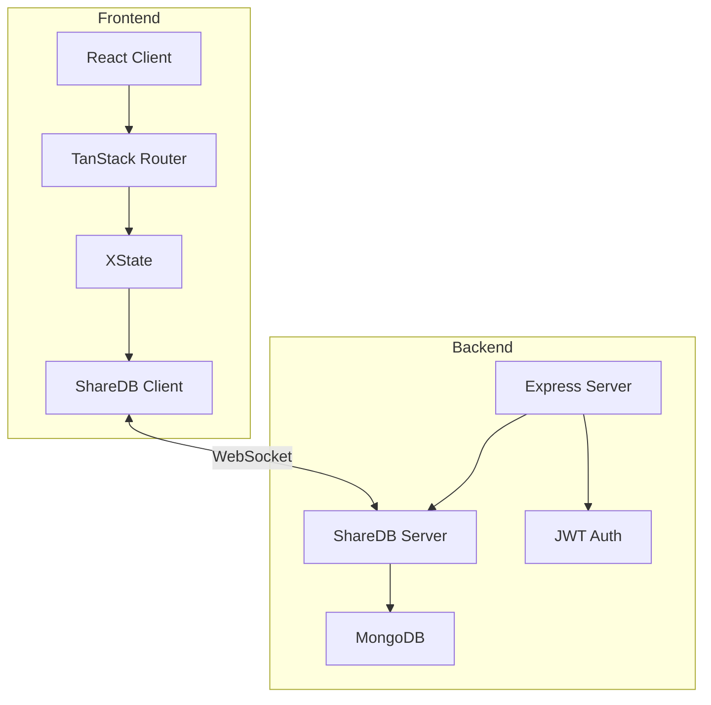

# Collaborative Document Editing Demo

Welcome to the documentation for the Collaborative Document Editing Demo application. This documentation covers everything you need to know about building, deploying, and extending this real-time collaborative editing platform.

## What is Collab Edit?

Collab Edit is a modern real-time collaborative document editing application built with cutting-edge web technologies:

- **Real-time Collaboration**: Multiple users can edit documents simultaneously with automatic conflict resolution
- **Type-Safe Architecture**: End-to-end TypeScript for reliability and developer experience
- **Scalable Design**: Monorepo structure with shared packages for consistency
- **Secure by Default**: JWT authentication, role-based access control, and document-level permissions

## Quick Start

Get started with Collab Edit in just a few minutes:

```bash
# Clone the repository
git clone https://github.com/austyle-io/pub-sub-demo.git
cd pub-sub-demo

# Install dependencies
make setup

# Start development environment
make dev
```

Visit [Getting Started](/getting-started) for detailed setup instructions.

## Architecture Overview



Learn more in our [Architecture Guide](/architecture).

## Key Features

### Real-time Collaboration
- **Operational Transformation**: Automatic conflict resolution for concurrent edits
- **WebSocket Communication**: Low-latency updates between clients
- **Presence Awareness**: See who's currently editing

### Security & Permissions
- **JWT Authentication**: Secure token-based authentication
- **Role-Based Access**: Admin, editor, and viewer roles
- **Document-Level ACL**: Fine-grained permission control

### Developer Experience
- **TypeScript First**: Full type safety across the stack
- **Monorepo Structure**: Shared code and consistent tooling
- **Comprehensive Testing**: User acceptance and integration tests

## Documentation Structure

This documentation is organized into several sections:

- **[Getting Started](/getting-started)**: Setup, prerequisites, and quick start guides
- **[Architecture](/architecture)**: System design, patterns, and technical decisions
- **[Development](/development)**: Development workflows, coding standards, and best practices
- **[Testing](/testing)**: Testing strategies, running tests, and writing new tests
- **[API Reference](/api)**: Complete API documentation (auto-generated from TypeScript)
- **[Deployment](/deployment)**: Production deployment guides and configurations

## Technology Stack

### Frontend
- **React 18**: Modern UI framework
- **TanStack Router**: Type-safe routing
- **XState**: State management
- **ShareDB Client**: Real-time sync

### Backend
- **Node.js & Express**: Server framework
- **ShareDB**: Operational transformation
- **MongoDB**: Document persistence
- **Passport.js**: Authentication

### Developer Tools
- **TypeScript**: Type safety
- **Turborepo**: Monorepo management
- **Biome**: Linting and formatting
- **Vitest**: Testing framework

## Contributing

We welcome contributions! Please see our [Development Guide](/development) for:
- Code style guidelines
- Development workflow
- Testing requirements
- Pull request process

## Support

- **Documentation**: You're here!
- **GitHub Issues**: [Report bugs or request features](https://github.com/austyle-io/pub-sub-demo/issues)
- **Discussions**: [Ask questions and share ideas](https://github.com/austyle-io/pub-sub-demo/discussions)

---

Ready to get started? Head to the [Getting Started Guide](/getting-started) →
