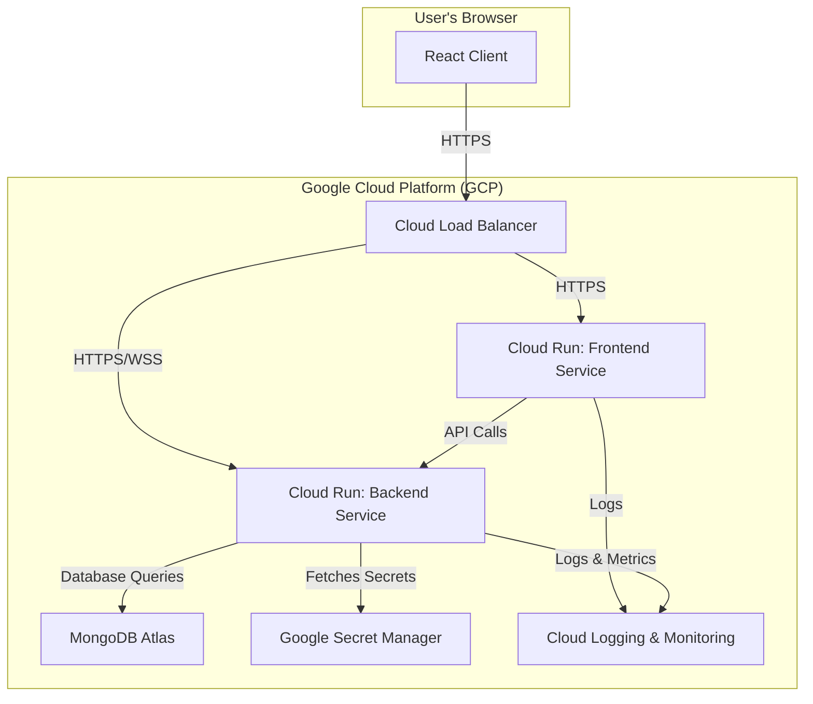

# Phase 6: Production Deployment

**Status**: 📋 Planned
**Target**: Q1 2025
**Dependencies**: Security hardening complete
**Objective**: Deploy the application to a production environment using Docker for containerization and Google Cloud Run for scalable, serverless hosting. This phase ensures the application is secure, monitored, and ready for public use.

## 🎯 **Overview**

This phase covers the end-to-end process of production deployment, from building optimized Docker containers to configuring a resilient cloud infrastructure on Google Cloud Platform (GCP). The primary goals are to achieve high availability, robust security, and comprehensive observability.

## ✅ **Deliverables**

- **Optimized Docker Images**: Secure, multi-stage Docker images for both frontend and backend services.
- **Cloud Infrastructure**: Fully configured Google Cloud Run services, load balancing, and a managed database.
- **CI/CD Pipeline**: An automated GitHub Actions workflow for continuous integration and deployment.
- **Monitoring & Alerting**: A comprehensive monitoring dashboard with proactive alerting for performance and errors.
- **Production-Ready Application**: A live, publicly accessible, and scalable version of the application.

## 🏗️ **Deployment Architecture**



## 📋 **Detailed Task Breakdown**

### 1. **Docker Containerization** (`4-6 hours`)
- [ ] **Frontend Dockerfile**: Create a multi-stage `Dockerfile` for the React client, using Nginx for serving.
- [ ] **Backend Dockerfile**: Create a multi-stage `Dockerfile` for the Express server, ensuring a non-root user.
- [ ] **Docker Compose**: Update `docker-compose.yml` for local production-like testing.
- [ ] **Image Optimization**: Minimize image sizes by leveraging layer caching and `.dockerignore`.
- [ ] **Vulnerability Scanning**: Integrate a scanning tool (e.g., Trivy, Snyk) into the CI pipeline to check for vulnerabilities.

### 2. **Cloud Infrastructure Setup (GCP)** (`6-8 hours`)
- [ ] **GCP Project**: Set up a new GCP project with billing enabled.
- [ ] **MongoDB Atlas**: Provision a managed MongoDB cluster on Atlas and configure network peering.
- [ ] **Secret Manager**: Store all sensitive data (API keys, JWT secrets, database URIs) in Google Secret Manager.
- [ ] **Cloud Run Services**:
    - [ ] Deploy the frontend service with appropriate auto-scaling and resource limits.
    - [ ] Deploy the backend service with database and secret connections.
- [ ] **Load Balancer**: Configure a global HTTP(S) load balancer with a managed SSL certificate.
- [ ] **Custom Domain**: Set up DNS records to point a custom domain to the load balancer.
- [ ] **IAM Permissions**: Configure fine-grained IAM roles for service accounts to ensure least privilege.

### 3. **CI/CD Pipeline (GitHub Actions)** (`4-6 hours`)
- [ ] **Workflow Definition**: Create a `deploy.yml` workflow for GitHub Actions.
- [ ] **Build & Push**: Add steps to build and push Docker images to Google Container Registry (GCR).
- [ ] **Deploy to Cloud Run**: Add steps to deploy the new images to the Cloud Run services.
- [ ] **Automated Testing**: Integrate smoke tests into the pipeline to verify deployment success.
- [ ] **Secrets Handling**: Use encrypted secrets in GitHub Actions for secure access to GCP.

### 4. **Monitoring & Alerting** (`3-5 hours`)
- [ ] **Structured Logging**: Ensure all logs are in a structured JSON format for easy parsing in Cloud Logging.
- [ ] **Health Check Endpoint**: Implement a comprehensive `/health` endpoint in the backend.
- [ ] **Cloud Monitoring Dashboard**: Create a dashboard to visualize key metrics (CPU, memory, latency, error rates).
- [ ] **Alerting Policies**:
    - [ ] Set up alerts for high error rates (>1%).
    - [ ] Set up alerts for high latency (>500ms p95).
    - [ ] Set up alerts for resource utilization (CPU/memory > 80%).
- [ ] **Uptime Checks**: Configure uptime checks to monitor the application's public endpoint.

## 🐳 **Docker Implementation Details**

### **Frontend Dockerfile**
```dockerfile
# Stage 1: Build the application
FROM node:20-alpine AS builder
WORKDIR /app
RUN corepack enable pnpm
COPY package.json pnpm-lock.yaml .
COPY apps/client/package.json ./apps/client/
COPY packages/shared/package.json ./packages/shared/
RUN pnpm install --frozen-lockfile
COPY . .
RUN pnpm --filter @collab-edit/client build

# Stage 2: Serve with Nginx
FROM nginx:1.25-alpine AS final
COPY --from=builder /app/apps/client/dist /usr/share/nginx/html
COPY apps/client/nginx.conf /etc/nginx/conf.d/default.conf
EXPOSE 80
CMD ["nginx", "-g", "daemon off;"]
```

### **Backend Dockerfile**
```dockerfile
# Stage 1: Build the application
FROM node:20-alpine AS builder
WORKDIR /app
RUN corepack enable pnpm
COPY package.json pnpm-lock.yaml .
COPY apps/server/package.json ./apps/server/
COPY packages/shared/package.json ./packages/shared/
RUN pnpm install --frozen-lockfile
COPY . .
RUN pnpm --filter @collab-edit/server build

# Stage 2: Production runner
FROM node:20-alpine AS final
WORKDIR /app
ENV NODE_ENV=production
RUN addgroup --system --gid 1001 nodejs && adduser --system --uid 1001 nextjs
USER nextjs
COPY --from=builder /app/apps/server/dist ./dist
COPY --from=builder /app/node_modules ./node_modules
EXPOSE 8080
CMD ["node", "dist/server.js"]
```

## 🚀 **Rollout and Rollback Plan**

### **Rollout Strategy (Blue-Green Deployment)**
1.  **Deploy New Version**: The CI/CD pipeline deploys the new version to a "staging" or "blue" environment in Cloud Run without directing traffic to it.
2.  **Run Smoke Tests**: Automated tests are run against the staging environment to verify its health.
3.  **Gradual Traffic Shift**: If tests pass, traffic is gradually shifted from the old version ("green") to the new version. Start with 10%, then 50%, then 100%.
4.  **Monitor**: Closely monitor error rates and performance metrics during the traffic shift.
5.  **Complete Rollout**: Once 100% of traffic is on the new version, the old version is scaled down.

### **Rollback Procedure**
- **Automated Rollback**: If smoke tests fail or if error rates spike during the traffic shift, the pipeline will automatically revert traffic to the previous stable version.
- **Manual Rollback**: A manual rollback can be triggered in the GCP console by redirecting 100% of traffic back to the last known good revision.

## 📈 **Success Metrics**

- **Uptime**: 99.9% or higher.
- **API Latency**: p95 latency under 200ms.
- **Error Rate**: Less than 0.1% of all requests.
- **Deployment Frequency**: Ability to deploy multiple times a day.
- **Change Failure Rate**: Less than 5% of deployments cause a production issue.

---

**📋 Phase 6 Planned** - This updated plan provides a more detailed and actionable roadmap for a successful production deployment.
