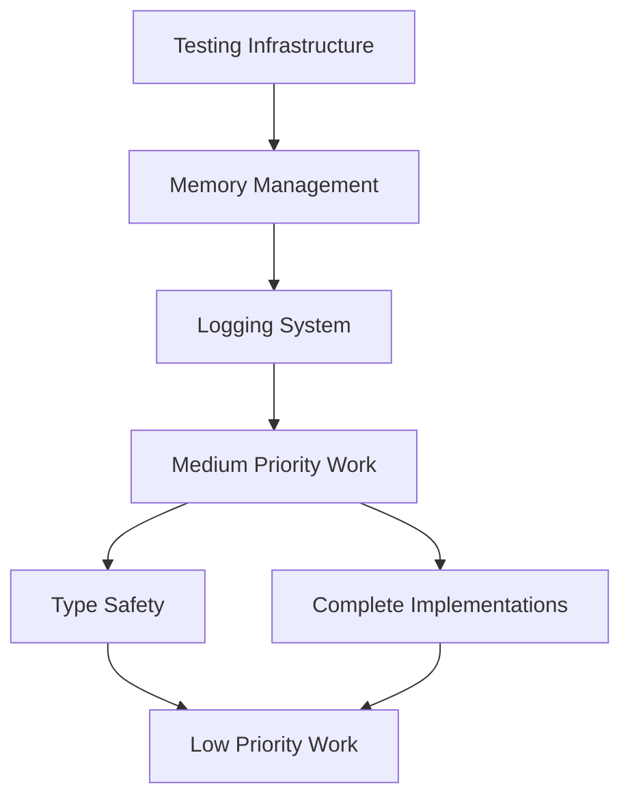

# Map Module Improvement Roadmap

## Overview

This roadmap consolidates all map module improvements identified in the comprehensive code review, organized by priority and timeline to guide development efforts.

## Code Review Summary

### 🎯 Overall Assessment: B+ (Good with room for improvement)

**Strengths:**

- Excellent architecture and design patterns
- Strong TypeScript typing system
- Comprehensive feature set with widget system
- Good documentation and code organization

**Critical Issues Fixed:**

- [x] ✅ Memory leak potential in event handling
- [x] ✅ Race conditions in error recovery
- [x] ✅ Cross-module coupling in PerformanceOptimizer

**Remaining Concerns:**

- Missing comprehensive testing coverage (to be addressed with React Testing Library)
- Console logging should be replaced with structured logging (to be addressed with Pino v8)
- Several incomplete implementation stubs
- Type safety could be strengthened

---

## Priority-Based Roadmap

### 🔴 High Priority (Blocking Production)

**Timeline: 2-3 weeks**
**Risk Level: Critical**

#### Week 1: Testing Infrastructure & Memory Management

- [ ] Set up comprehensive testing framework (Jest/Vitest + React Testing Library)
- [ ] Install and configure React Testing Library and jest-environment-jsdom
- [ ] Create test utilities and MapLibre GL JS mocks using React Testing Library
- [ ] Add cleanup methods to all singleton services
- [ ] Implement proper map instance cleanup
- [ ] Add resource tracking and disposal methods

#### Week 2: Testing Implementation

- [ ] Write unit tests for error recovery logic with proper mocking
- [ ] Write unit tests for performance optimizer using React Testing Library
- [ ] Write unit tests for widget registry with React Testing Library utilities
- [ ] Write integration tests for map store using React Testing Library providers
- [ ] Write integration tests for widget communication with React Testing Library

#### Week 3: Logging & Final Testing

- [ ] Install and configure Pino v8 with pino-pretty for development
- [ ] Implement Pino-based structured logging service with child loggers
- [ ] Replace all console statements with Pino structured logging
- [ ] Configure environment-specific log levels and external monitoring
- [ ] Achieve >80% test coverage using React Testing Library
- [ ] Performance testing and validation

**Files Affected:** [See high-priority plan](./map-module-high-priority.md)

---

### 🟡 Medium Priority (Quality & Completeness)

**Timeline: 3-4 weeks**
**Risk Level: Medium**

#### Week 4-5: Dependencies & Architecture

- [ ] Extract shared utilities to common package
- [ ] Implement dependency inversion for widget system
- [ ] Abstract widget system interfaces
- [ ] Standardize import patterns across modules

#### Week 6: Complete Implementations

- [ ] Finish layer diffing algorithm in PerformanceOptimizer
- [ ] Complete change application logic
- [ ] Enhance sync utilities for all source types
- [ ] Implement proper widget lazy loading

#### Week 7: Type Safety

- [ ] Add runtime type validation with schemas
- [ ] Create type guards for branded types
- [ ] Strengthen event payload type system
- [ ] Add proper generic constraints

**Files Affected:** [See medium-priority plan](./map-module-medium-priority.md)

---

### 🟢 Low Priority (Core Polish & Optimization)

**Timeline: 2 months**
**Risk Level: Low**

#### Month 1: Performance Optimization

- [ ] Implement memoization for expensive operations
- [ ] Add virtualization for large datasets
- [ ] Optimize map config synchronization with batching
- [ ] Add event processing optimization

#### Month 2: Enhanced Error Handling

- [ ] Create user-friendly error message system
- [ ] Add widget error boundaries with react-error-boundary
- [ ] Implement contextual error suggestions
- [ ] Complete documentation updates

**Files Affected:** [See low-priority plan](./map-module-low-priority.md)

---

### 🧚‍♀️ **Good Idea Fairy** (One-Day Implementations)

**Timeline: Ongoing (as time permits)**
**Risk Level: Very Low**

Collection of valuable enhancements that can be implemented as **individual day sprints** during cool-down periods, hackathons, or learning exercises:

#### **Quick Wins Available** (4-8 hours each)

- [ ] Request deduplication strategies
- [ ] Error analytics integration (DataDog/Sentry)
- [ ] Accessibility error announcements
- [ ] Map debugging inspector
- [ ] Widget development tools
- [ ] Performance monitoring dashboard
- [ ] Security enhancements (CSP, sanitization)
- [ ] Internationalization support
- [ ] CI/CD pipeline integration
- [ ] Error tracking & recovery metrics

**Files Affected:** [See good idea fairy plan](./map-module-good-idea-fairy.md)

---

## Critical Path Analysis

### Dependencies

### Parallel Work Opportunities

- **Testing & Memory Management** can be done in parallel
- **Dependencies & Type Safety** can be worked on simultaneously
- **Performance & Error Handling** can be developed concurrently

---

## Resource Requirements

### Team Size Recommendations

- **High Priority**: 2-3 developers (full-time for 3 weeks)
- **Medium Priority**: 1-2 developers (part-time over 4 weeks)
- **Low Priority**: 1 developer (part-time over 2 months)
- **Good Idea Fairy**: Any developer (1 day sprints as time permits)

### Skill Requirements

- **Testing**: Jest/Vitest, React Testing Library, @testing-library/jest-dom, MapLibre GL JS mocking
- **Logging**: Pino v8, pino-pretty, structured logging patterns, child logger concepts
- **Memory Management**: JavaScript memory profiling, React lifecycle, browser dev tools
- **Type Safety**: Advanced TypeScript, schema validation (Zod)
- **Performance**: Web performance optimization, bundling, virtualization

---

## Quality Gates

### High Priority Gate

**Must Pass Before Medium Priority Work**

- [ ] All critical tests passing with >80% coverage using React Testing Library
- [ ] No memory leaks detected in browser dev tools
- [ ] All event listeners properly cleaned up
- [ ] Pino v8 structured logging implemented and working with child loggers
- [ ] Error recovery system fully tested with React Testing Library
- [ ] MapLibre GL JS properly mocked and tested

### Medium Priority Gate

**Must Pass Before Low Priority Work**

- [ ] No cross-module imports outside defined interfaces
- [ ] All placeholder implementations completed
- [ ] Runtime type validation working
- [ ] Event system fully type-safe
- [ ] Integration tests passing

### Production Ready Gate

**Must Pass Before Production Deployment**

- [ ] Performance benchmarks meet targets
- [ ] Error handling graceful and user-friendly
- [ ] Accessibility requirements met
- [ ] Security audit completed
- [ ] Documentation complete and up-to-date

---

## Monitoring & Success Metrics

### Technical Metrics

- **Test Coverage**: >80% across all modules
- **Performance**: Page load <2s, Memory usage <100MB
- **Error Rate**: <1% widget failures, >90% error recovery success
- **Type Safety**: Zero production `any` types

### User Experience Metrics

- **Error Recovery**: >90% automatic resolution rate
- **Performance**: 60fps maintained during interactions
- **Accessibility**: WCAG 2.1 AA compliance
- **Developer Experience**: Hot reload <1s, build time <30s

### Business Metrics

- **Development Velocity**: Feature delivery time reduced by 25%
- **Bug Rate**: Production issues reduced by 50%
- **Maintainability**: Code review time reduced by 30%
- **Onboarding**: New developer productivity improved

---

## Risk Mitigation

### High-Risk Areas

1. **Testing Infrastructure Changes**

    - Risk: May uncover existing bugs
    - Mitigation: Implement incrementally, fix issues as discovered

2. **Memory Management Refactoring**

    - Risk: Could introduce new bugs
    - Mitigation: Extensive testing, monitoring in staging

3. **Widget System Changes**
    - Risk: Breaking changes for widget developers
    - Mitigation: Maintain backward compatibility, provide migration guide

### Contingency Plans

- **Timeline Slippage**: Prioritize high-priority items, defer low-priority
- **Resource Constraints**: Focus on critical path, parallelize where possible
- **Technical Blockers**: Implement feature flags, maintain fallbacks

---

## Long-term Vision

### Future Enhancements (Beyond Current Scope)

- WebGL layer support for advanced rendering
- Advanced spatial operations and analysis
- Plugin architecture expansion
- Real-time collaboration features
- Advanced accessibility features
- Performance monitoring dashboard

### Technical Debt Maintenance

- Regular dependency updates
- Performance optimization reviews
- Security audit schedule
- Documentation maintenance
- Test suite maintenance

---

## Getting Started

### Immediate Next Steps

1. **Set up development environment** for testing with React Testing Library and Pino v8
2. **Install dependencies**: `pino@^8.15.0`, `@testing-library/react@^13.4.0`, `jest-environment-jsdom@^29.6.0`
3. **Create project tracking** (GitHub issues/project board)
4. **Assign team members** to high-priority tasks
5. **Set up monitoring** for memory usage and performance
6. **Begin with testing infrastructure** setup using React Testing Library patterns

### Communication Plan

- **Weekly progress reviews** during high-priority phase
- **Bi-weekly check-ins** during medium-priority phase
- **Monthly reviews** during low-priority phase
- **Quarterly architectural reviews** for long-term planning

---

## Conclusion

The map module is well-architected but needs focused attention on testing, memory management, and completion of implementations before production deployment. The roadmap provides a clear path to address all identified issues while maintaining development velocity and code quality.

**Streamlined Approach**: We've separated core functionality (high/medium/low priority) from nice-to-have enhancements (Good Idea Fairy). This allows teams to focus on production-critical work while providing a menu of valuable one-day implementations for sprint buffers, hackathons, or learning exercises.

**Recommendation**:

1. Begin immediately with high-priority items (production blocking)
2. Schedule medium and low-priority items based on team capacity
3. Use Good Idea Fairy items as flexible sprint fillers and learning opportunities
